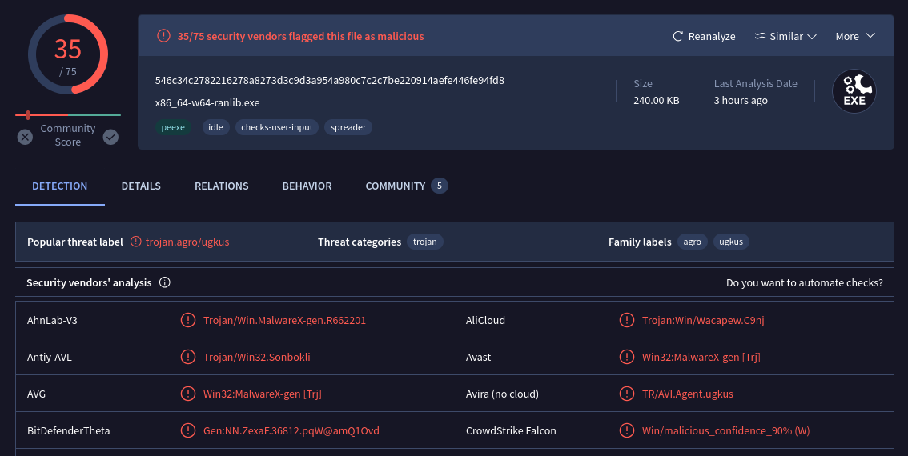
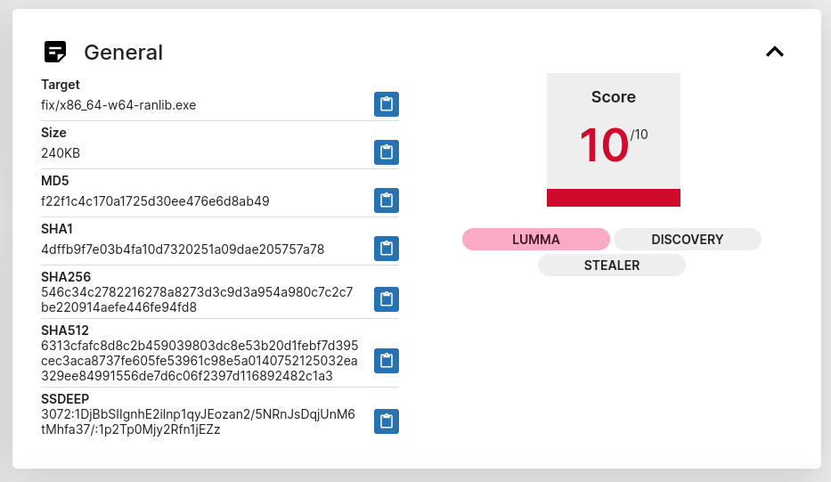
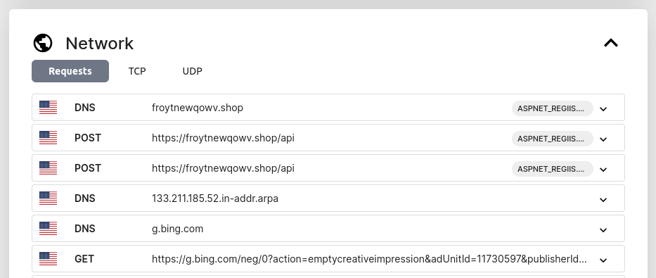
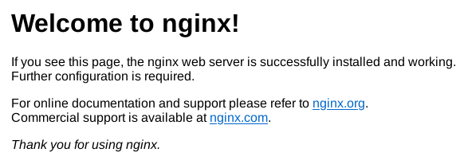
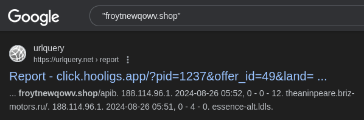
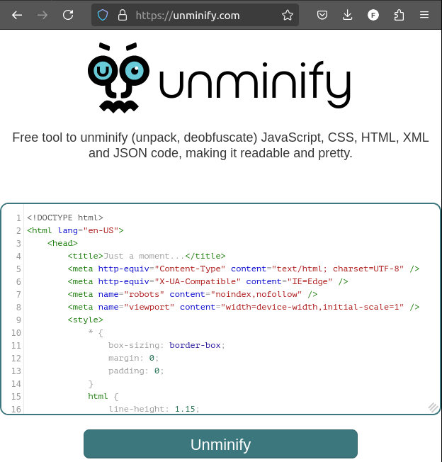
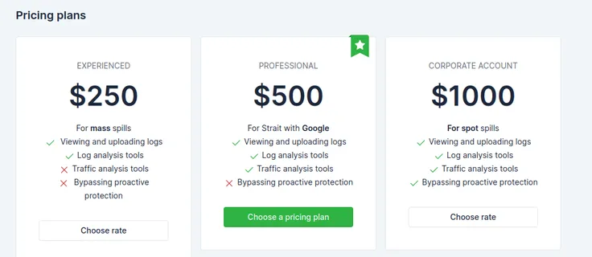

+++
date = '2024-09-10T11:00:00+01:00'
title = 'A Helpful Noob'
summary = "Open Source Intelligence of Malware"
description = "Analyzing malware posted in a GitHub thread"
author = ["Ole", "https://github.com/OleMussmann"]
issueLink = "https://github.com/OleMussmann/ole.mn/issues"
tags = ["cybersecurity", "malware", "GitHub"]
draft = false

toc = false
autonumber = false
readTime = true
math = false
showTags = true
hideBackToTop = false
hidePagination = true
fediverse = "@ole@fosstodon.org"

[sitemap]
disable = false
+++


Yesterday, my colleague [Faruk](https://github.com/fdiblen) asked me to conduct a Hallway Test for the [`NLeSC/python-template`](https://github.com/NLeSC/python-template) he is working on: he just grabbed me off the hallway and asked me to give it a spin. This is, however, not a story about the test, but of open-source intelligence (OSINT) and the contributions of yet another "helpful noob".

Right after I posted my feedback in an [issue](https://github.com/NLeSC/python-template/issues/554) of the project, someone else posted a helpful contribution right underneath:


Huh? It took this person only a few seconds to post a fix for quite a list of small changes that I posted. That's so nice! So let's do a review of _their_ contributions.

## Trail: GitHub

Their GitHub handle is `xiaobai-marker`. XiaoBai is (Pinyin writing of) Chinese and translates to "little white", not referring to the actual color, but more in the direction of "unsullied". It means Little Noob.

A brief dive into `xiaobai-marker`'s GitHub profile (by now mysteriously removed) confirms this initial impression.


They forked only three publicly available repositories. They apparently deal with self-driving toy cars and machine learning to detect road lanes. Fun! However, that's not a lot of content for someone who seems to contribute to other projects, especially considering that they did not open any repositories themselves.

But we're not judging. Any contributions are welcome, and that includes those from people with little experience. So let's have a look at their actual contribution.

## Trail: Download Link

MediaFire is a known file storage and sharing website. Clicking _this_ link is not _per se_ dangerous. Still, we proceed with caution.


MediaFire uses VirusTotal to scan for malicious files. This inspires confidence, right? An encrypted `*.zip` file, however, is opaque to any scans since we can't look inside without the password, which was supplied on GitHub and is not known to MediaFire or VirusTotal. Another interesting detail is where the file comes from. Apparently it was uploaded the same day from somewhere in Russia. Is our Little Noob from Russia?

Let's check out the files now.

## Trail: Files

What did we actually download? A rather small zip file.

```bash
$ ls -lah fix.zip
-rw-r--r-- 1 ole users 367K Aug 27 08:15 fix.zip
```

Providing the password, we can unpack it and have a look at the content.

```bash
$ 7z e -pchangeme fix.zip

7-Zip [64] 17.05 : Copyright (c) 1999-2021 Igor Pavlov : 2017-08-28
p7zip Version 17.05 (locale=en_US.UTF-8,Utf16=on,HugeFiles=on,64 bits,8 CPUs x64)

Scanning the drive for archives:
1 file, 375771 bytes (367 KiB)

Extracting archive: fix.zip
--
Path = fix.zip
Type = zip
Physical Size = 375771

Everything is Ok

Folders: 1
Files: 2
Size:       747008
Compressed: 375771
```

What did we just unpack?

```bash
$ ls -lah fix/
total 456K
-rw-r--r-- 1 ole users 490K Aug 27 08:15 msvcp140.dll
-rw-r--r-- 1 ole users 240K Aug 27 08:15 x86_64-w64-ranlib.exe
```

Huh. `ranlib` is a standard programming tool, although here it is supposed to be an installer (!). This "fix" seems to have been written for a Windows system. I can't run it on my Linux machine. Bummer. I'm also not very good at decompiling `*.exe` files to check what's really inside. But we can ask some websites for assistance.

### VirusTotal

First we upload the file to [virustotal.com](https://virustotal.com), a Google-owned file and link analyzer and one of the authorities in the space of malware indexing. On the day of the initial analysis, 28 of 75 security vendors [flagged the files as malicious](https://www.virustotal.com/gui/file/546c34c2782216278a8273d3c9d3a954a980c7c2c7be220914aefe446fe94fd8/detection). You don't say! One day later this number is up to 35. It seems to be a fresh strain that is quickly being picked up by the security community.



So what do we have here? "Trojan"? "MalwareX"? This is still quite vague.

> Fun fact: One of the analyses — fourth row, right side — comes from CrowdStrike. Those are guys that [crashed](https://arstechnica.com/information-technology/2024/07/major-outages-at-crowdstrike-microsoft-leave-the-world-with-bsods-and-confusion/) some [8.5 million rather important Windows computers](https://blogs.microsoft.com/blog/2024/07/20/helping-our-customers-through-the-crowdstrike-outage/), resulting in [over 10.000 cancelled flights](https://www.oxfordeconomics.com/resource/crowdstrike-update-grounds-thousands-of-flights/) and causing some [$15 billion damages worldwide](https://www.neowin.net/news/systems-paralyzed-by-crowdstrike-within-78-minutes-to-cause-15-billion-in-losses-worldwide/) in July 2024. Oops.

### Tria.ge

[Tria.ge](https://tria.ge/) provides a malware analysis sandbox and provides reports for submitted samples. Some kind soul already [uploaded the one we found](https://tria.ge/240826-vhsrtawepj/behavioral4).



"Lumma"? "Stealer"? What's that? Apparently this malware tries to steal... things? Let's look into this.

Some more interesting details can be found further down in the network section of the analysis. What's a malware to do after it did its deeds? It has to send the stuff it found _somewhere_, right? So Triage ran the malware in a sandbox and recorded the network traffic. These are some of the connections the malware made:



`froytnewqowv.shop` seems to be the URL of the Command-and-Control (C2) server of this malware. It tells the malware what to do and collects the bountiful harvest. Also take note of the `froytnewqowv.shop/api` path that we will explore in a minute.

## Trail: C2 server

Let's see if we can find out more about who our malware talks to. WHO IS the one that owns the weird domain name?

> "WHOIS is a public database that houses the information collected when someone registers a domain name"
>
>    — https://www.domain.com/blog/what-is-whois-and-how-is-it-used/

### WhoIs

A [whois](https://www.whois.com/whois/froytnewqowv.shop) look-up shows that the domain was registered just a few days ago via [namecheap.com](https://www.namecheap.com/). This register hides the client's contact information, like physical address or email.


Furthermore, we see from the "Name Server" entries that they hide behind [Cloudflare](https://www.cloudflare.com/). This service can, among other things, act as an intermediary between a user and a website. This means that we cannot directly find out the IP address — the "actual address" that the URL is translated into — of the C2 server, since all the traffic is routed through Cloudflare's machines first.

Little Noob is privacy-conscious.

Let's give the C2 server a visit then. We open the website in a browser.


Note that it's usually not a good idea to browse possibly malicious sites, since they _can_ infect your computer.


### Browsing the C2 website

Opening the URL in a browser lets us see:



Well, that's not much. This is the default landing page of their `nginx` web server, with no content whatsoever. Let's have a look at the source code of this website then, by pressing `CTRL+U` in the browser.

```html
<html>
  <head><title>405 Not Allowed</title></head>
  <body>
    <center><h1>405 Not Allowed</h1></center>
    <hr><center>nginx/1.18.0 (Ubuntu)</center>
  </body>
</html>
```

Ah yes. Privacy conscious. At least we learn that the server runs `nginx` version `1.18.0` on Ubuntu.

If we look back at the network section of the Triage analysis, we see that the malware made a request to the `/api` path. API stands for Application Programming Interface and is basically a somewhat standardized interface for talking to computers programmatically. What does that API path look like in the browser?


I guess I'm not invited to that party. Let's explore the website a bit more and guess some other paths.


Nope. Not that easy, apparently. `404` is browser-speak for "I can't find what you asked of me". Let's see what Google knows about this URL.



Aha. Another path: `/apib`. Where does this lead to?


Another dead end? But this one look different. Russian again. How come? After trying some more URLs by hand, it is apparent that everything that starts with `/api` is leading to this _other_ `404`-not-found page:

- `/apia`
- `/apib`
- `/api_I_misconfigured_my_nginx_server`
- etc.

Let's see what we can learn from this page. Translation:

```
404

Oops... There was a mistake

Sorry, this page was not found or
the administrator has closed access to it

<- To the main page
```

No surprises here. Let's download the whole thing and see what we get.

### Website source code

The website source contains the following files:

```bash
$ tree
.
├── Ошибка_files
│   ├── dober.html
│   ├── doberman.min.html
│   ├── jquery-3.6.0.min.js
│   ├── tabler-flags.min.css
│   ├── tabler-icons.min.css
│   ├── tabler.min.css
│   ├── tabler.min.js
│   ├── tabler-payments.min.css
│   ├── tabler-vendors.min.css
│   ├── tom-select.complete.min.js
│   └── tom-select.css
└── Ошибка.html
```

Our error page seems to have been built with [tabler.io](https://tabler.io/). This seems to be a bit too much effort for a simple `404` page. Tabler is often used to build elaborate dashboards. So there's probably more to it.

The `css` files are Cascading Style Sheets (CSS), which are used for styling a web page. Not too interesting. [`tom-select`](https://tom-select.js.org/) is a standard JavaScript framework for UI control. [`jquery`](https://jquery.com/) is a library to simplify HTML development, assisting with document traversal and other things.

The interesting ones that remain are `dober.html` and `doberman.min.html`. What are those? Let's have a look.

The content of `dober.html` is one single line of text which looks like this:

```html
<!DOCTYPE html><html lang="en-US"><head><title>Just a moment...</title><meta http-equiv="Content-Type" content="text/html; charset=UTF-8"><meta http-equiv="X-UA-Compatible" content="IE=Edge"><meta name="robots" content="noindex,nofollow"><meta name="viewport" content="width=device-width,initial-scale=1"><style>*{box-sizing:border-box;margin:0;padding:0}html{line-height:1.15;-webkit-text-size-adjust:100%;color:#313131}button,html{font-family:system-ui,-apple-system,BlinkMacSystemFont,Segoe UI,Roboto,Helvetica Neue,Arial,Noto Sans,sans-serif,Apple Color Emoji,Segoe UI Emoji,Segoe UI Symbol,Noto Color Emoji}@media (prefers-color-sch...
```

Urgh. This HTML vomit is "minified", which means it is condensed as much as possible to save bandwidth when opening a website. This makes it hard to read for us humans, though. Luckily we can get some help with disentangling it.

### Unminify.com

While there are Integrated Development Environments (IDEs) that can disentangle minified HTML, there are also [websites](https://unminify.com) that do this for you with a click of a button.



The code in the screenshot above is now much more readable. Below in the unminified code of `doberman.min.html` we can find a reference to a file that does not seem to exist. An excerpt of `doberman.min.html`:

```html
<script>
    (function () {
        window._cf_chl_opt = {
            cvId: "3",
            cZone: "froytnewqowv.shop",
            cType: "interactive",
            cNounce: "11691",
            cRay: "8b96971bcef66608",
            cHash: "a7c37071216d981",
            cUPMDTk: "\/core\/panel\/js\/doberman.min.js?2&__cf_chl_tk=POTzyU0ftLF9cvsIaAitlr5np8LsKoghhsVMME6MjWg-1724704337-0.0.1.1-2559",
```

Where is this file `/core/panel/js/doberman.min.js` referenced here? It was not downloaded with the rest. Is it being dynamically created and loaded? I would not know without more time to study it. Again, luckily, other people already did the hard work for us. Searching for this file string on Google leads to an [in-depth report](https://www.intrinsec.com/wp-content/uploads/2023/10/TLP-CLEAR-Lumma-Stealer-EN-Information-report.pdf) by the French security firm [Intrisec](https://www.intrinsec.com/). The mysterious file is apparently not present anymore in this "newer" version of the Lumma Stealer:

> We also noticed the absence of the file "doberman.min.js" on new Lumma C2 panel [...]

The full report is a fascinating read. Here's the summary:

> **Various actors actively deploying Lumma Stealer in multiple campaigns**
>
> Lumma Stealer, also known as LummaC2 Stealer, is a malware-as-a-service sold through Telegram and Russian-speaking cybercrime forums. [...] Lumma is an information stealer written in C/C++ language that has been observed in the wild since at least August 2022. [...] This malware is designed to pilfer sensitive data from infected devices. Among the data targeted are cryptocurrency wallets, browser extensions, two-factor authentication codes, logins and passwords stored on browsers, and various files.

## Trail: Business Case

[Outpost24](https://outpost24.com/) [explored the malware in detail](https://outpost24.com/blog/everything-you-need-to-know-lummac2-stealer/), including their store. Joining the dark side starts sets you back $250, or a bit more if you aim for best-value. Granted, the chance of someone falling for this weak threat is low. But if the net is cast wide enough...? Imagine just a few victims falling for the malware, finding just _one_ [juicy crypto-wallet](https://techinformed.com/crypto-hackers-have-already-stolen-almost-1-4-billion-this-year/). The amount of potential profit per dollar is staggering, as is the damage caused.



## Takeaways

As Research Software Engineers we don't often think about cybersecurity. Our institute, the [Netherlands eScience Center](https://www.esciencecenter.nl/), is an independent foundation and not a company with valuable trade secrets. We don't usually work in projects that are high-profile targets. Nevertheless, people who write code are increasingly targeted by cyber-criminals. Do you remember the [drama around the program `xz utils`](https://arstechnica.com/security/2024/04/what-we-know-about-the-xz-utils-backdoor-that-almost-infected-the-world/) in March 2024? A user infiltrated a widely used open-source project, earned trust by making meaningful contributions, and finally injected a malicious backdoor into the source code. It was caught just in time before it was distributed widely.

The case discussed here is a much cruder approach, amateurish even. Malware-as-a-service, like the Lumma Stealer, makes malware accessible for the masses, enabling this spray-and-pray approach. We can expect its use to only increase in time. It shows that all of us can be targets, at any time.

Stay vigilant.
