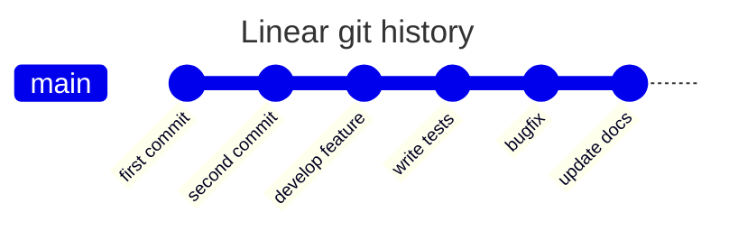
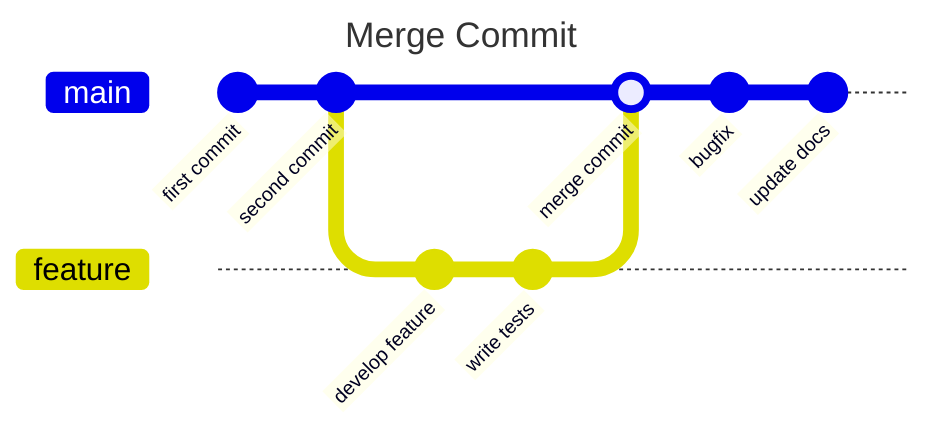
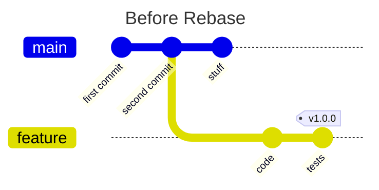
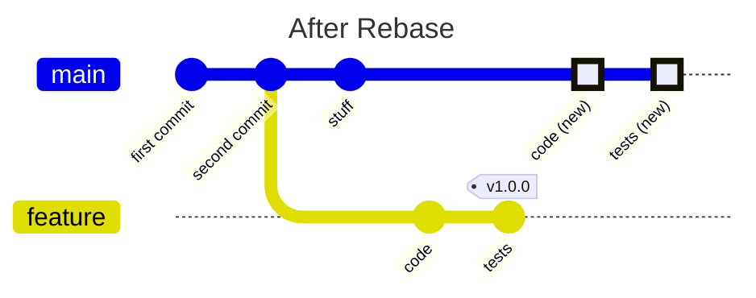
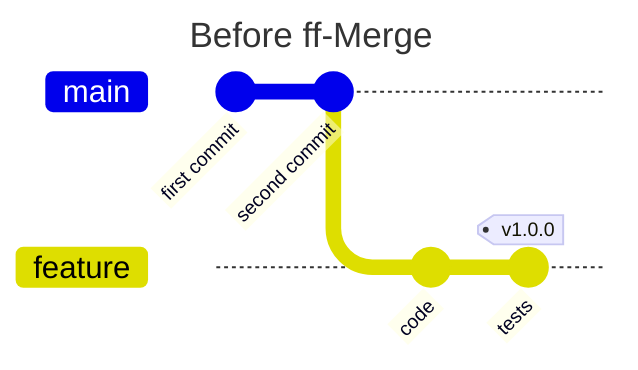
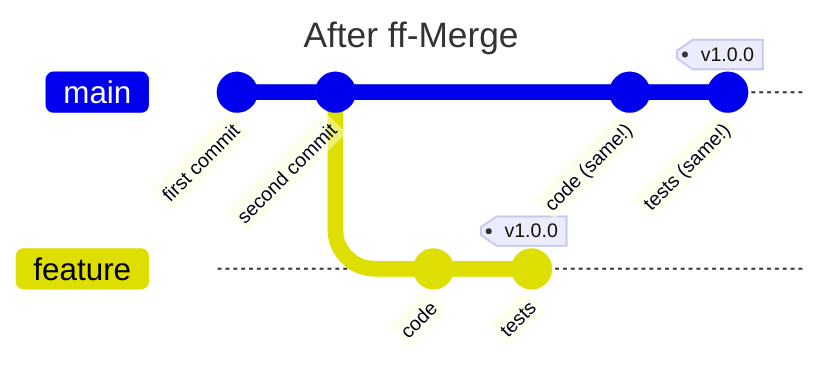

+++
date = '2025-02-13T12:00:00+01:00'
title = 'Fast-Forward Merges on GitHub'
summary = "The year is 2025 CE and GitHub.com still can’t do “fast-forward” merges via its web-interface. But _you_ can. I’ll show you how."
description = "Automated fast-forward merges on GitHub.com"
author = ["Ole", "https://github.com/OleMussmann"]
issueLink = "https://github.com/OleMussmann/ole.mn/issues"
tags = ["GitHub", "git"]
draft = false

toc = false
autonumber = false
readTime = true
math = false
showTags = true
hideBackToTop = false
hidePagination = true
fediverse = "@ole@fosstodon.org"

[sitemap]
disable = false
+++


> "I've got no time for prose, give me a solution!" [Sure, click here to get to the juicy bits.](#solutions) For the readers with patience, the story starts below.

[Github.com](https://github.com) offers version-control-as-a-service, with all kinds of useful things bolted on top. The year is 2025 A.C. and GitHub leverages the vast power of `git` and exposes it entirely to their users. Well, not entirely... One small feature of indomitable usefulness still holds out against the invaders. Well OK. Here the stories diverge.

One `git` feature that is not available via the [github.com](https://github.com) web interface are "fast-forward (ff) merges". It is among the highest `git`-related feature requests with about 1500 upvotes.[^1] To explain what that is and why one would want this, we have to take a detour first.

[^1]: Upvote count combines upvotes and thumbs-up from https://github.com/orgs/community/discussions/4618

## Intermezzo: Merge Types

To set the ground for explaining fast-forward merging, I'll cherry-pick (chuckle) a specific scenario.

Let's follow best practices where we have our `main` branch protected, meaning that we cannot add changes to it directly. Any changes that should end up in `main` will be merged via pull- (GitHub speak) or merge- (same, but GitLab speak) requests. That way there can be some auditing before code ends up in the `main` branch. This could prevent minor hiccups like the [CrowdStrike-related IT outages](https://en.wikipedia.org/wiki/2024_CrowdStrike-related_IT_outages).


Granted, I don't think code pushed to `main` was the cause for the global-scale IT outage, but it would have been funny if it was -- however funny [~$10 billion in damages](https://www.businessinsider.com/businesses-claiming-losses-crowdstrike-outage-insurance-billions-losses-cyber-policies-2024-7) can be.

A bit more opinionated than protecting `main` is the choice to keep the `git` commit history linear. With "commit" we mean a snapshot in time -- a set of related changes to your code with a specific description -- so you can find it back later. Reasons for a linear `git` history could be that you follow the [Git V Branching Model](https://finitestate.io/blog/git-v-branching-model) or if you want to have [Abel](https://abelsiqueira.com/)'s [Utopic Git History](https://blog.esciencecenter.nl/the-utopic-git-history-d44b81c09593). In general, `git` commit graphs can look a bit complicated.


")

### Branches

To compartmentalize development tasks and to keep the repository tidy, we often use "branches". These are alternative realities of your code-base, and you can jump back and forth between them like [Dr. Strange](https://marvelcinematicuniverse.fandom.com/wiki/Doctor_Strange).

Instead of the mess above, let's simplify our `git` commit history such that it looks like a straight string of pearls. In the following visualizations, time progresses towards the right. The horizontal lines represent branches, and the nodes on them are commits with a certain commit message. They _also_ have a specific fingerprint, called "hash", that uniquely identifies them. We will come back to that later.





When we work on a feature or a bugfix (or anything, really) we usually do that on a separate branch, nicely separated. After we finished working on this branch, we want to _somehow_ get the changes we made back onto the `main` branch. There are different approaches for that.

### Merge Commit

"Standard" merge commits leave the history where exactly the code came from intact. An extra "merge commit" contains the changes from our `feature` branch.



### Rebase

Another way to keep the `git` history linear is "rebasing". This approach basically re-plays the new commits that happened on the `feature` branch onto the `main` branch. This means that there is no "merge commit" on the `main` branch anymore. However, if there have been commits to `main` after `feature` has been branched off, the `feature` commits are re-written. Do you remember the "hash" fingerprint, I [mentioned before](#branches)? Here it becomes important. When rebasing, the commit content and commit messages are the same, but since these are effectively "new" commits, the commit hashes are different! This means that anything that was attached to a certain hash, like signatures or tags, will point to the commits on the `feature` branch. To demonstrate this, we attached a tag `v1.0.0` to one commit on the `feature` branch.





Do you see how the tag is kept dangling on the now useless `feature` branch?

### Fast-forward Merging

"Fast-forward" merging can be achieved if `main` did _not receive any commits_ in the meantime. So clean! Instead of re-writing the commits onto another branch, the `main` _and_ `feature` commits are basically pointers to the exact same commit.






This looks very similar to rebasing, does it not?

In fact, if the `main` branch did not receive any new commits since the branching, fast-forward merging is the same as rebasing...

## GitHub Rebasing
...unless you are using the GitHub web interface. When you rebase a `feature` branch on GitHub onto an untouched `main` branch, the commits are still re-written. This is contrary to how `git` on the command line works. Why is that such a big deal? The commit messages are the same. The commit content is the same. Why worry about a different commit hash?

It matters, because lots of things are tied to a commit hash. A commit signature is tied to its hash! The signature gets lost if the hash changes during a rebase. The same holds true for tags. `feature` commit tags will point to the commits on the `feature` branch, not to the re-written ones on `main`.

## Solutions
Oh hi! You probably fast-forwarded directly to the solutions. Fine. I'm not judging. There are two ways to achieve fast-forward merging when using GitHub. One is convoluted and error prone. The other one is cursed. Choose wisely.

### Using Local `git`
Protecting your `main` branch means that you can't commit to it directly. You can, however, push sanctioned changes from `main` to your remote repository on [github.com](https://github.com). Wait, what? I thought you can't touch `main` ? Follow me, I'll show you.

- Create a pull request from `feature` to `main` on [github.com](https://github.com)
- Open a terminal and create some magic:
  ```bash
  cd your/project/folder     # cd into your project directory
  git pull    # get the latest changes to your local computer
  git switch main      # select the main branch, if necessary
  git merge --ff-only feature    # ff-merge feature onto main
  git push      # allowed! because you created a pull request
  ```
- The pull request is automatically closed 🪄

While rather low-tech, this relies on the workflow and discipline of the developers to work. This is a danger zone. It is 4:55pm on a Friday afternoon. You opened a pull request to contribute your work on the `feature` branch and now watch patiently how the green circle closes that shows that all CI tests passed. Your fingers itch to wrap things up quickly so you can go home and wolf down the lasagna you prepared already the day before.

The mouse cursor hovers over the fat, green "Merge pull request" button.


**Stop! Resist the temptation!**

Click that button and you need to spend the next half hour undoing the rebased, re-written commits to `main`, while sweating profusely because now you are messing directly with the `main` branch, which you tried to prevent by protecting it in the first place. And by now, at home, your partner has finished both their and your piece of the lasagna.

Instead of following the suggested path, you need to step away from the browser and open the terminal. You pull the changes, fast-forward merge locally and finally push to `main`, as shown above.

### Using Actions
This approach needs some set-up, but is safer to use afterwards.

#### Disable the Merge Button
We have learned now that the fat, green "Merge" button is dangerous[^2], so we need to disable it. In your GitHub repository, go to

[^2]: If you want to achieve fast-forward merging, that is.

> Settings → General → Pull Requests

and allow only Squash Merging. Next, go to

> Settings → Rules → Rulesets

and add a new rule. Name it `disable_merge_button`, set it to "Active". Set the "Target branches" to the "default branch" a.k.a. `main`. Check "Require a pull request before merging" and, while waving a magic wand 🪄, set "Allowed merge methods" to "Rebase", contradicting the general repository settings. Check whichever other settings you would like and click on "Save changes".

Now pull requests cannot be merged anymore. Yay?

#### Automate the Wizardry
Set up the "Fast Forward Merge" Action from the GitHub Marketplace: https://github.com/marketplace/actions/fast-forward-merge . This gives you two things:
- A message posted in the PR chat indicating whether fast-forward merging is possible.
- A GitHub Action that fast-forward merges your Pull Request. You trigger it by commenting `/fast-forward` in the Pull Request chat.

N.B.: For the triggered ff-merge to work, the Action yml file has to already exist in the `main` branch. So you have to get it there _once_ via impure means.

It works. Yet it feels dirty. You just made a forbidden deal with ~~Cthulhu~~ Octocat and you will probably need to sacrifice the lasagna you made so it does not come to haunt you at night.

## Wrap-Up
By now you not only know what fast-forward merging is, you also have ways to use it on your external repository on [github.com](https://github.com). You might have subscribed to [github.com/orgs/community/discussions/4618](https://github.com/orgs/community/discussions/4618) and now patiently wait for the powers-that-be to enable this feature on their website.

Until that happens, feel free to choose one of the workarounds outlined above.



Cross post: » [medium.com](https://medium.com/@ole-mn/fast-forward-merges-on-github-752f900f45e8) » [blog.esciencecenter.nl](https://blog.esciencecenter.nl/fast-forward-merges-on-github-752f900f45e8)
